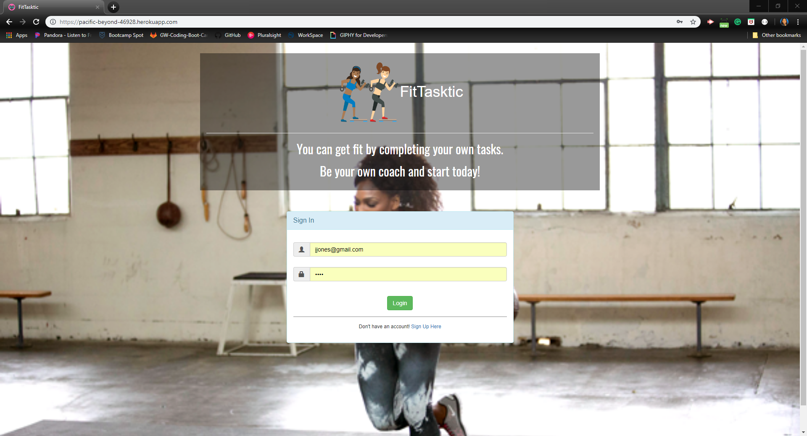
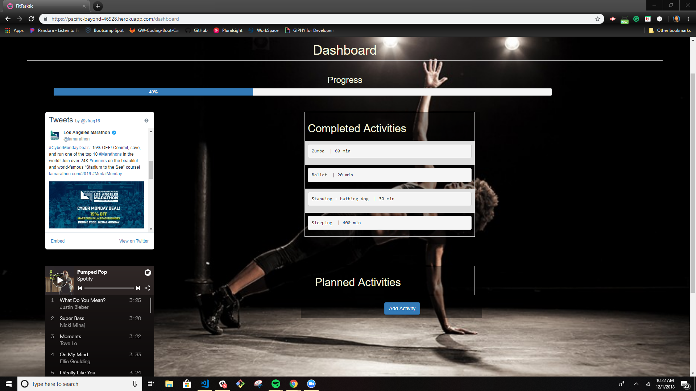
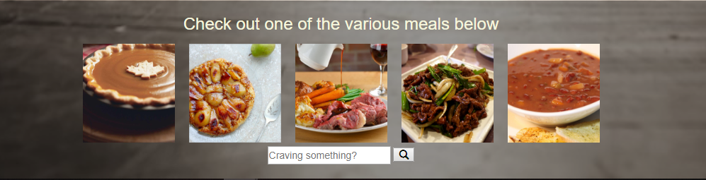
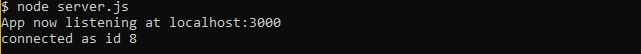

# Project-2
GW Project #2

<h1>FitTasktic</h1>
A fitness app where you can get fit your own way!

<h2>Description</h2>
This application demonstrates a simple full stack application with a front end implemented with HTML/CSS and the backend implemented with several APIs Mysql ORM Node.js and Express. HTML templating is done with the help of Handlebars.

The user may select their own activities, or "tasks" to complete within their own desired time-frame. A progress bar is included to allow the use to keep track of the activites they are completing; specifically 10 activities will equal 100% completion. Additionally, the application includes a random selection of meals and directions on how to prepare the meals with detailed videos from youtube. Finally, there is a twitter timeline included, for users to view their own tweets or those of their followers, and a workout spotify playlist that users can sign-in and select different music, or listen to demo if the user does not have a spotify account.

<h2>Demo</h2>
<i>FitTasktic</i> is deployed to Heroku. Please check it out <a href="https://pacific-beyond-46928.herokuapp.com/">here</a>.

<h2>Installation</h2>
To install the application follow the instructions below:

<ol>
    <li>git clone git@github.com:valfragier16/Project-2.git</li>
    <li>cd Project-2</li>
    <li>npm install</li>
</ol>

<h2>Run Locally</h2>
Once you have completed installation, to access the application in your browser, first run <i>node server.js</i> in your terminal within the <i>Project-2</i> folder.

If done properly, your terminmal should display the following:

Now, open the local application on port 3000 at the URL: <i>http://localhost:3000/</i>.

<h2>Presentation</h2>
To view our presentation about our app, check it out <a href="https://www.emaze.com/@AOFZZWQCW/fittastic-app">here</a> 
<iframe src='https://app.emaze.com/@AOFZZWQCW/fittastic-app' width='960px' height='540px' seamless webkitallowfullscreen mozallowfullscreen allowfullscreen></iframe>
